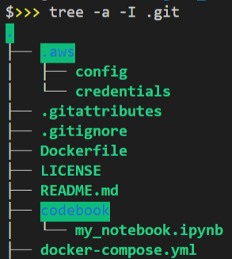

# Glue Box
Adapted from the article ["Developing AWS Glue ETL jobs locally using a container"](https://aws.amazon.com/blogs/big-data/developing-aws-glue-etl-jobs-locally-using-a-container/)  by Vishal Pathak. 

## Set up

Create the following folder structure within the cloned repository folder if you do not want to update the `docker-compose.yml` file:



## AWS credentials and IAM role configuration

Set credentials as follows:
```
[base_profile_name]
AWS_ACCESS_KEY_ID=<your_AWS_ACCESS_KEY_ID_here>
AWS_SECRET_ACCESS_KEY=<your_AWS_SECRET_ACCESS_KEY_here>
```
Set config as follows:
```
[base_profile_name]
region=<your_AWS_REGION_here>
output=json
```

Append config as described by [AWS documentation](https://docs.aws.amazon.com/cli/latest/userguide/cli-configure-role.html) to assume a particular IAM role.
```
[profile <your_profile_name>]
role_arn=<your_role_arn_here>
source_profile=base_profile_name
```

## Codebook folder
Your notebooks and helper functions go in this folder. 
This folder is ignored by git to decouple it from the docker code.

## docker-compose.yml configuration
Change the volume tags to mount a different codebook folder and/or .aws folder.